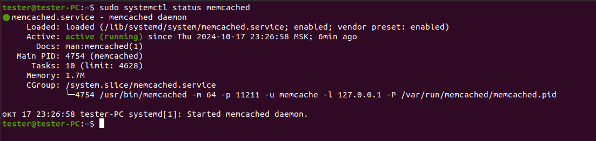
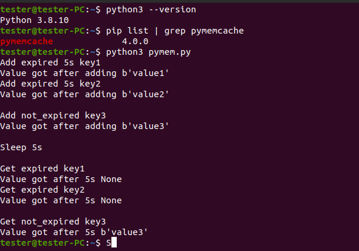
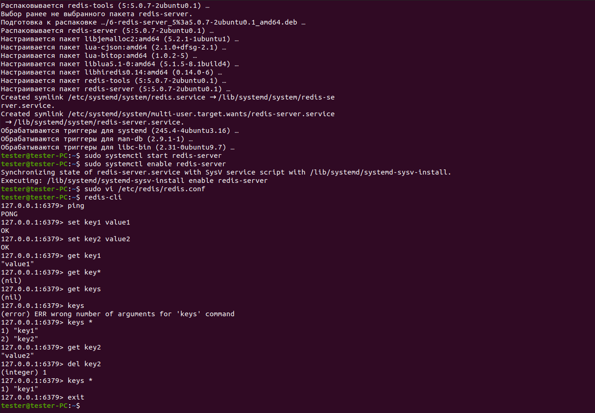

# Домашнее задание к занятию «`Кеширование Redis/memcached`» - `Коряко Виталий`

https://github.com/netology-code/sdb-homeworks/blob/main/11-02.md

---

### Задание 1. Кеширование 

Приведите примеры проблем, которые может решить кеширование.

*Приведите ответ в свободной форме.*

### Решение 1

1. Повышение производительности и увеличение скорости ответа, которое достигается за счет складывания в кэш данных, к которым чаще всего происходит обращение;
2. Экономия ресурсов базы данных, например, применяя кэширование тяжелых запросов;
3. Сглаживание бустов трафика. Например, во время черной пятницы онлайн-магазины используют кэш, чтобы переживать резкое увеличение трафика.

---

### Задание 2. Memcached

Установите и запустите memcached.

*Приведите скриншот systemctl status memcached, где будет видно, что memcached запущен.*


### Решение 2

```
https://github.com/memcached/memcached/wiki
https://losst.pro/ustanovka-memcached-v-ubuntu

sudo apt-get install memcached
sudo systemctl restart memcached
```


---

### Задание 3. Удаление по TTL в Memcached

Запишите в memcached несколько ключей с любыми именами и значениями, для которых выставлен TTL 5.

*Приведите скриншот, на котором видно, что спустя 5 секунд ключи удалились из базы.*


### Решение 3

```
sudo apt install python3 python3-pip
pip3 install pymemcache

nano pymem.py # see pymem.py

python3 pymem.py

```
[pymem.py](./pymem.py)



---

### Задание 4. Запись данных в Redis

Запишите в Redis несколько ключей с любыми именами и значениями. 

*Через redis-cli достаньте все записанные ключи и значения из базы, приведите скриншот этой операции.*


### Решение 4

```
https://github.com/redis/redis
https://losst.pro/ustanovka-redis-v-ubuntu-18-04

sudo apt install redis-server
sudo systemctl start redis-server
sudo systemctl enable redis-server
redis-cli

```



---

## Дополнительные задания (со звёздочкой*)

Эти задания дополнительные, то есть не обязательные к выполнению, и никак не повлияют на получение вами зачёта по этому домашнему заданию. Вы можете их выполнить, если хотите глубже разобраться в материале.

### Задание 5*. Работа с числами 

Запишите в Redis ключ key5 со значением типа "int" равным числу 5. Увеличьте его на 5, чтобы в итоге в значении лежало число 10.  

*Приведите скриншот, где будут проделаны все операции и будет видно, что значение key5 стало равно 10.*